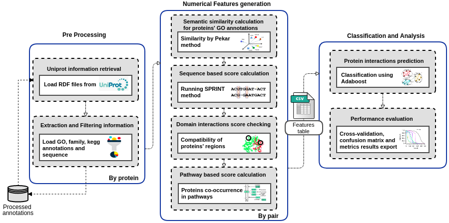

# PredPPI

Scientific workflow to predict protein-protein interactions based in a combined analysis of multiple protein characteristics.

## Summary
PredPPI is a scientific workflow to predict Protein-Protein Interactions (PPIs) using machine learning to combine multiple PPI detection methods of proteins according to three categories: structural,  based on primary aminoacid sequence and functional annotations.<br>

PredPPI contains three main steps: (i) acquirement and treatment of protein information, (ii) feature generation, and (iii) classification and analysis.

(i) The first step builds a knowledge base with the available annotations of proteins and reuses this base for other prediction experiments, saving time and becoming more efficient. 

(ii) The feature generation step involves several evidence from different classes, such as: Gene Ontology (GO) information, domain interaction, metabolic pathway participation and sequence-based interaction. For the GO branches, we made a study to evaluate the best method to calculate semantic similarity to enhance the workflow performance. This step can be easily modified by adding new metrics, making PredPPI flexible for future improvements. 

Finally, (iii) in the third step, the adaboost classifier is responsible for predicting the final scores from the numerical features dataset, exporting results of performance evaluation metrics.

The figure below illustrates the steps of this workflow.

<div style="text-align: center">
	
</div>

## Requirements:
* Installing via anaconda and pip or pip3:

	- luigi
	- sqlalchemy
	- rdflib
	- sklearn
	- functools

* Installing via pip or pip3 (anaconda already has these packages):
	- matplotlib
	- numpy
	- json
	- urllib

* Other instalation:
	- sqlite (to be able to see the documentation generated by luigi about the tasks after execution)

## Usage Instructions
The steps below consider the creation of a sqlite database file with all he tasks events which can be used after to retrieve the execution time taken by the tasks. It is possible run locally too (see luigi's documentation to change the running command). <br ><br>
* Preparation:
	1. ````git clone https://github.com/YasCoMa/PredPPI.git````
	2. ````cd PredPPI````
	3. Download SPRINT pre-computed similarities in https://www.csd.uwo.ca/~ilie/SPRINT/precomputed_similarities.zip and unzip it inside core/sprint/HSP/
	4. Certify that there is a file named client.cfg (to configure the history log and feed the sqlite database). It must have the following data:
	````
	[core]
	default-scheduler-host=localhost
	default-scheduler-port=8082
	rpc-connect-timeout=60.0 
	rpc-retry-attempts=10    
	rpc-retry-wait=60        

	[scheduler]
	record_task_history = True

	[task_history]
	db_connection = sqlite:///luigi-task-hist.db
	````
* Parameters:
	1. parameters-file -> json file with all the information to process the prediction experiment (example: params.json)
	2. mode -> it can have two values: train (executes cross validation and save the model as a .joblib file) or test (uses a model obtained in train mode to test in some dataset listed in the parameters file)
	3. model -> it is the model file full path saved in train mode as .joblib
	
* Running:
	1. ````mkdir luigi_log```` (or other name for the log folder of your choice)
	2. ````luigid --background --logdir luigi_log```` (start luigi server)
	3. ````nohup python3.5 -m luigi --module main RunPPIExperiment --parameters-file params.json --mode 'train' --model --workers 3 &```` <br >
	   ````nohup python3.5 -m luigi --module main RunPPIExperiment --parameters-file params.json --mode 'test' --model model.jolib --workers 3 &```` <br >
		- Replace python3.5 by the command python of your environment <br>
		- Replace the data given as example in params.json using your own data <br > 
		- Adapt the number of workers to use as you need and the capacity of your computational resource available

	You can monitor the prediction experiment execution in localhost:8082

## Reference

## Bug Report
Please, use the [Issue](https://github.com/YasCoMa/PredPPI/issues) tab to report any bug.
